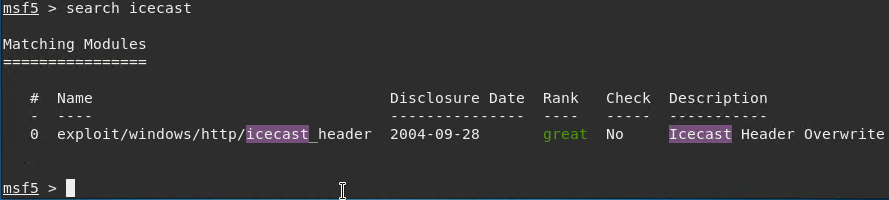
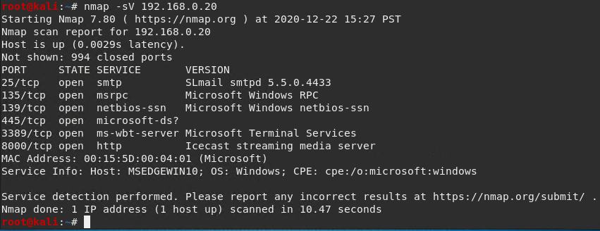

# Penetration_Test_Engagement
In this activity, I played the role of an independent penetration tester hired by "GoodCorp Inc." to perform security tests against their CEO's workstation.

## GoodSecurity Penetration Report

JosephMossman@GoodSecurity.com

12/22/20

### 1.0 High-Level Summary

GoodSecurity was tasked with performing an internal penetration test on GoodCorp’s CEO, Hans Gruber. An internal penetration test is a dedicated attack against internally connected systems. The focus of this test is to perform attacks, similar to those of a hacker and attempt to infiltrate Hans’ computer and determine if it is at risk. GoodSecurity’s overall objective was to exploit any vulnerable software and find the secret recipe file on Hans’ computer, while reporting the findings back to GoodCorp.
When performing the internal penetration test, there were several alarming vulnerabilities that were identified on Hans’ desktop. When performing the attacks, GoodSecurity was able to gain access to his machine and find the secret recipe file by exploiting two programs that had major vulnerabilities. The details of the attack can be found in the ‘Findings’ category.

### 2.0 Findings

Machine IP:

192.168.0.20

Hostname:

MSEDGEWIN10 (DVW10)

Vulnerability Exploited:

Icecast Header Overwrite

Vulnerability Explanation:
The Icecast Header Overwrite vulnerability running on 192.168.0.20 Host allows a buffer overflow exploit that lets an attacker system gain remote control of the victim system by overwriting the memory on the system. The exploit writes past the end of a pointer array when receiving 32 HTTP headers. This allowed for a variety of remote actions, such as file discovery and download, key logging, screen capture, and privilege escalation to Administrator.

Severity:
The severity of this vulnerability is High, with a CVSS score of 7.5.

Proof of Concept:

Perform a service and version scan using Nmap to determine which services are up and running:

-Run the Nmap command that performs a service and version scan against the target.
 Answer: nmap -sV 192.168.0.20
 

From the previous step, we see that the Icecast service is running. Let's start by attacking that service. Search for any Icecast exploits:
-Run the SearchSploit commands to show available Icecast exploits.
 Answer: searchsploit icecast

